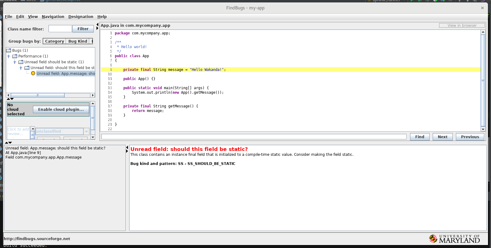

Findbugs / Jenkins Integration
==============================

Configure Findbugs Plugins
--------------------------

Working from the `Jenkins Tutorial <https://github.com/find-sec-bugs/find-sec-bugs/wiki/Jenkins-Tutorial>`_ .

First step is fulfill the prerequisites:

1) The project you are analyzing must be structured with maven configuration files - check
2) `FindBugs is configured <https://github.com/find-sec-bugs/find-sec-bugs/wiki/Maven-configuration>`_ in its root
   pom.xml - okay, work to do

When you hit the Step #2 link above, it provides a XML snippet of what to add to the existing project pom.xml. In
this case we're still working with the **simple-maven-java-app** but the new test version saved under
~/IdeaProjects/gerrit-projects/demo-project. The sample XML code looks like this:

.. code:: bash

   <!-- SpotBugs Static Analysis -->
        <plugin>
            <groupId>com.github.spotbugs</groupId>
            <artifactId>spotbugs-maven-plugin</artifactId>
            <version>3.1.1</version>
            <configuration>
                <effort>Max</effort>
                <threshold>Low</threshold>
                <failOnError>true</failOnError>
                <includeFilterFile>${session.executionRootDirectory}/spotbugs-security-include.xml</includeFilterFile>
                <excludeFilterFile>${session.executionRootDirectory}/spotbugs-security-exclude.xml</excludeFilterFile>
                <plugins>
                    <plugin>
                        <groupId>com.h3xstream.findsecbugs</groupId>
                        <artifactId>findsecbugs-plugin</artifactId>
                        <version>LATEST</version> <!-- Auto-update to the latest stable -->
                    </plugin>

When I tried to cut and paste this I ran into some issues with IntelliJ that seemed to indicate I needed to:

1) Turn on auto-import (which it asked me to do automatically)
2) Insert the initial <plugin></plugin> XML tags using the IntelliJ capability. For the initial tags, place the cursor
   in the existing XML where you want to insert the tags, the righ-click to bring up the context menu and select
   **Generate...**. This will bring up a sub-menu. Here select **Plugin Template** and it will pop it in with the
   associated groupID, artifactID and version tags.
3) Cut and paste the sample code into the appropriate spots. Once inside the auto-generated <plugin></plugin> tags
   you can manually create the other tags and IntelliJ will automatically generate the closing tags.

With the update integrated and saved, test it out with the following commands:

.. code:: bash

   # In the project directory (where you newly modified pom.xml is located)
   mvn compile
   mvn findbugs:findbugs

   # If all that goes well bring up the findbugs GUI and check out your one bug
   mvn findbugs:gui

With this working properly, we now return to the Jenkins integration portion of the tutorial. First step here is
download the `FindBugs Plug-in <http://wiki.jenkins-ci.org/x/GYAs>`_ into Jenkins via Manage Jenkins->Manage Plugins.
Confirm that the static analysis collector plugin was also downloaded with the FindBugs Plug-in. With the appropriate
plugins installed, the last step is to add the extra required configurations to your existing pipeline job. In my case,
this is the Gerrit-Demo-Project job. Here are the specific steps:

1) hmmm - this should go in the Jenkinsfile...

Build : Change the goals to something similar to clean install findbugs:findbugs. f
indbugs:findbugs needs to be after the compilation process.

Build Settings : Check "Publish FindBugs analysis results"

