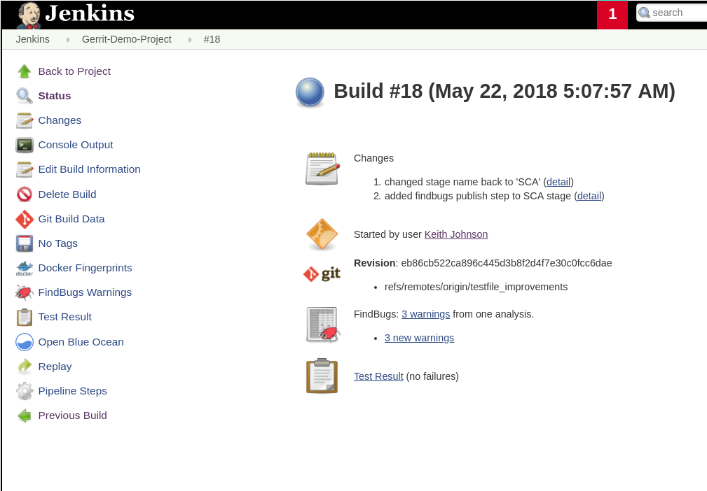

Findbugs / Jenkins Integration
==============================

Configure Findbugs Plugins
--------------------------

Working from the `Jenkins Tutorial <https://github.com/find-sec-bugs/find-sec-bugs/wiki/Jenkins-Tutorial>`_ .

First step is fulfill the prerequisites:

1) The project you are analyzing must be structured with maven configuration files - check
2) `FindBugs is configured <https://github.com/find-sec-bugs/find-sec-bugs/wiki/Maven-configuration>`_ in its root
   pom.xml - okay, work to do

When you hit the Step #2 link above, it provides a XML snippet of what to add to the existing project pom.xml. In
this case we're still working with the **simple-maven-java-app** but the new test version saved under
~/IdeaProjects/gerrit-projects/demo-project. The sample XML code looks like this:

.. code:: bash

   <!-- SpotBugs Static Analysis -->
        <plugin>
            <groupId>com.github.spotbugs</groupId>
            <artifactId>spotbugs-maven-plugin</artifactId>
            <version>3.1.1</version>
            <configuration>
                <effort>Max</effort>
                <threshold>Low</threshold>
                <failOnError>true</failOnError>
                <includeFilterFile>${session.executionRootDirectory}/spotbugs-security-include.xml</includeFilterFile>
                <excludeFilterFile>${session.executionRootDirectory}/spotbugs-security-exclude.xml</excludeFilterFile>
                <plugins>
                    <plugin>
                        <groupId>com.h3xstream.findsecbugs</groupId>
                        <artifactId>findsecbugs-plugin</artifactId>
                        <version>LATEST</version> <!-- Auto-update to the latest stable -->
                    </plugin>

When I tried to cut and paste this I ran into some issues with IntelliJ that seemed to indicate I needed to:

1) Turn on auto-import (which it asked me to do automatically)
2) Insert the initial <plugin></plugin> XML tags using the IntelliJ capability. For the initial tags, place the cursor
   in the existing XML where you want to insert the tags, the righ-click to bring up the context menu and select
   **Generate...**. This will bring up a sub-menu. Here select **Plugin Template** and it will pop it in with the
   associated groupID, artifactID and version tags.
3) Cut and paste the sample code into the appropriate spots. Once inside the auto-generated <plugin></plugin> tags
   you can manually create the other tags and IntelliJ will automatically generate the closing tags.

With the update integrated and saved, test it out with the following commands:

.. code:: bash

   # In the project directory (where you newly modified pom.xml is located)
   mvn compile
   mvn findbugs:findbugs

   # If all that goes well bring up the findbugs GUI and check out your one bug
   mvn findbugs:gui

.. image:: images/findbugs_window.png
   :align: center

With this working properly, we now return to the Jenkins integration portion of the tutorial. First step here is
download the `FindBugs Plug-in <http://wiki.jenkins-ci.org/x/GYAs>`_ into Jenkins via Manage Jenkins->Manage Plugins.
Confirm that the static analysis collector plugin was also downloaded with the FindBugs Plug-in. With the appropriate
plugins installed, the last step is to add the extra required configurations to your existing pipeline job.

Here the instructions mention, checking the **"Publish FindBugs analysis results"** option in the **Build Settings**
section. This action presumes we're
using a Jenkins **Maven** project, but we are using a Jenkins **Pipeline** project so we need to take a different
approach to publishing the findbugs results after the findbugs analysis.

To implement findbugs publishing in a pipeline script, do the following:

1) Go to the Jenkins Dashboard and click on your target job. In this case, this would be
   the **Gerrit-Demo-Project** job
2) In the left-hand command list, click on the **Pipeline Syntax** hyperlink to open up the pipeline
   syntax window
3) What we want to do is add another step to our 'SCA' stage in our Jenkinsfile. The pipeline syntax page will help
   generate the exact command we need to paste in. So, in the **Steps** section, click the drop-down dialog prefaced
   with the text **Sample Step**. In this drop-down, scroll down and select the **step: General Build Step** option.
4) This shows another drop-down dialog box prefaced with the text **Build Step**. In this drop-down, scroll down and
   select the **Publish Findbugs analysis results** option.
5) This opens up a text box prefaced with the text **FindBugs Results**. In here, copy the text
   **\**/findbugsXml.xml**

.. note::
   The note below the 'FindBugs Results' text box mentions that it's possible the findbugs.xml file can take a couple
   forms (e.g. findbugs.xml or findbugXml.xml, etc.). In order to determine the target file name, I looked in the
   Jenkins container. In my setup I ran the command **docker exec -i -t Jenkins_Master /bin/bash** where
   **Jenkins_Master** is the name of my container. Next, You'll note that the **docker-compose.yaml** file
   lists the volume **jenkins_home:/var/jenkins_home**. So in the container, I found my FindBugs results XML
   file under **/var/jenkins_home/workspace/Gerrit-Demo-Project/target/**. In my case the file name was findbugsXml.xml.

.. note:: If you want to configure more FindBugs options, click on the **Advanced** button. Here you can set things like
          status thresholds, health thresholds, etc. I left these alone, but if I wanted to have the build fail based on
          the number and/or severity of defects found, that can be configured here

6) Next, click on the **Generate Pipeline Script** button to do just that. The appropriate pipeline syntax for your
   FindBugs result publishing step will appear. Copy that text
7) Now, edit your project Jenkinsfile and paste this new step in the 'SCA' stage. The result should look similar to
   the code snippet below

.. code:: bash

   stage('SCA') {
    steps {
        sh 'mvn findbugs:findbugs'
        findbugs canComputeNew: false, defaultEncoding: '', excludePattern: '', healthy: '',
        includePattern: '', isRankActivated: true, pattern: '**/findbugsXml.xml', unHealthy: ''
    }

Commit and push this Jenkinsfile change and re-run the Gerrit-Demo-Project job. Once the build completes, click on the
job build # hyperlink (e.g. #18) under the **Last Success** column which takes you to the build results page. On this
page, you'll sections for your FindBugs results and your test results. Yummy goodness.

