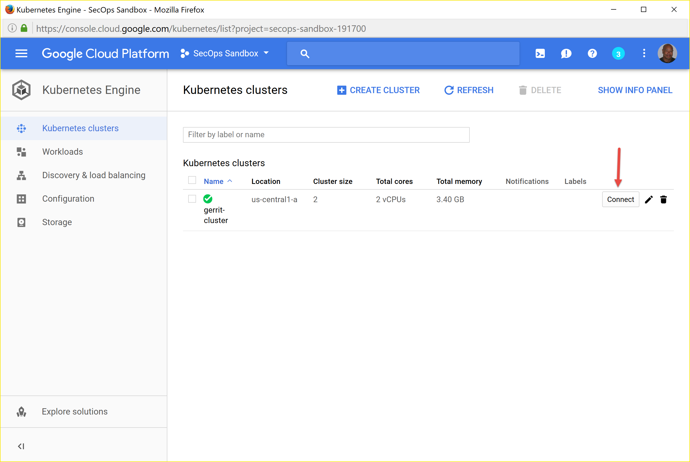

Google Cloud Platform Cluster Setup
===================================

Creating A New Project
----------------------
Navigate to `Google Cloud Platform <https://console.cloud.google.com/home/dashboard>`_ and
click on the project down-arrow to pull up the project selection dialog box:

.. image:: images/gc_new_project.png
   :align: center

In the project selection dialog box, click on the **'+'** button. In the next dialog, give
your project a name and wait for it to come up before clicking on the project name link back
in the project selection box.

.. image:: images/project_sel_dialog.png
   :align: center

Creating a Gerrit Server Cluster
--------------------------------

Once the project has come up, from the project dashboard, click on the three horizontal lines
in the upper left next to **Google Cloud Platform** to show the **Product & Services** menu.
Scroll down to **Kubernetes Engine** and select **Kubernetes Clusters** and click on the
**Create Cluster** button to create a Kubernetes cluster.

.. image:: images/kubernetes_engine.png
   :align: center

Fill in the relevant info. My cluster creation data was:

    * Name: gerrit-cluster
    * Machine Type: small
    * Size: 2

The rest of the options I left defaulted. Click the **Create** button and wait for the
cluster to be created. This can take 2-3 minutes. Once the cluster is created, click on
the 'Connect' button to access the **Google Cloud Shell** to configure your cluster.

I ran the following commands pulled from `Google Cloud Platform Kubernetes Quick Start
Guide <https://cloud.google.com/kubernetes-engine/docs/quickstart>`_. It's a little
dated as many of the cluster creation commands are now automated by the above process.

Specifically, I ran the following:

.. code-block:: bash
   :linenos:

   # Get authentication credentials for the cluster
   gcloud container clusters get-credentials gerrit-cluster --zone us-central1-a --project secops-sandbox-191700

   # Deploying an application to the cluster
   # Creating the Deployment
   kubectl run gerrit-server --image=gerritcodereview/gerrit --port 8080

   # Exposing the Deployment
   kubectl expose deployment gerrit-server --type="LoadBalancer"

   # Inspecting and viewing the application
   kubectl get service gerrit-server

This last command will show you what the cluster's external IP address is. In order to
connect to the service from a local web browser, just browse to: **http://<external-ip>:8080**.
If all goes well, when you browse there you'll see the Gerrit Server screen.

.. tip:: The > **kubectl run** command uses the following **--image=gerritcodereview/gerrit**.
   This image name was pulled from the `GerritCodeReview/docker-gerrit Github repo
   <https://github.com/GerritCodeReview/docker-gerrit>`_

.. warning::
   If this work is temporary, once you've made your observations, follow the instructions
   in the `Google Cloud Platform Kubernetes Quick Start Guide
   <https://cloud.google.com/kubernetes-engine/docs/quickstart>`_ to shutdown and delete
   your cluster. Day to day load balancing charges can add up.
.. tip::
   If you want to resume your work without going back through the set up, you can change
   your cluster size to zero which effectively shuts it down (though you may still get
   load balancing charges - check to be sure). To resume again, resize your cluster back
   to its original node size. Use these commands:
   > **gcloud config set compute/zone <zone>**
   > **gcloud container clusters resize $CLUSTER_NAME --size=0**

Docker Overview
---------------
Since what's actually created within the Kubernetes cluster pods are docker containers,
we should step back and get a better understanding of Docker.

Drop knowledge here

Interacting with Kubernetes
---------------------------
Once your cluster is set up, you'll want to be able to interact with the
nodes(VMs)/containers providing your service. Information in the section is
pulled from the`Kubernetes.io Tutorials
<https://kubernetes.io/docs/tutorials/kubernetes-basics/explore-intro/>`_

Kubernetes Cluster
~~~~~~~~~~~~~~~~~~
The Master is responsible for managing the cluster. The master coordinates all
activities in your cluster, such as scheduling applications, maintaining
applications' desired state, scaling applications, and rolling out new updates.

A node is a VM or a physical computer that serves as a worker machine in a Kubernetes
cluster. Each node has a Kubelet, which is an agent for managing the node and
communicating with the Kubernetes master. The node should also have tools for
handling container operations, such as Docker or rkt. A Kubernetes cluster that
handles production traffic should have a minimum of three nodes.

When you deploy applications on Kubernetes, you tell the master to start the
application containers. The master schedules the containers to run on the cluster's
nodes. The nodes communicate with the master using the Kubernetes API, which the
master exposes. End users can also use the Kubernetes API directly to interact with
the cluster.

.. image:: images/kube_cluster.png
   :align: center

Deployments
~~~~~~~~~~~
Once you have a running Kubernetes cluster, you can deploy your containerized
applications on top of it. To do so, you create a Kubernetes Deployment
configuration. The Deployment instructs Kubernetes how to create and update
instances of your application. Once you've created a Deployment, the Kubernetes
master schedules mentioned application instances onto individual Nodes in the cluster.

Once the application instances are created, a Kubernetes Deployment Controller
continuously monitors those instances. If the Node hosting an instance goes down
or is deleted, the Deployment controller replaces it. This provides a self-healing
mechanism to address machine failure or maintenance.

.. image:: images/kube_deployment.png
   :align: center

Pods Overview
~~~~~~~~~~~~~
A Pod is a group of one or more application containers (such as Docker or rkt) and
includes shared storage (volumes), IP address and information about how to run them.

Pods are the atomic unit on the Kubernetes platform. When we create a Deployment on
Kubernetes, that Deployment creates Pods with containers inside them
(as opposed to creating containers directly). Each Pod is tied to the Node where
it is scheduled, and remains there until termination (according to restart policy)
or deletion. In case of a Node failure, identical Pods are scheduled on other
available Nodes in the cluster.

Pods that are running inside Kubernetes are running on a private, isolated network.
By default they are visible from other pods and services within the same kubernetes
cluster, but not outside that network. When we use **kubectl**, we're interacting
through an API endpoint to communicate with our application.

.. image:: images/pods_overview.png
   :align: center

Nodes Overview
~~~~~~~~~~~~~~
A Pod always runs on a **Node**. A Node is a worker machine in Kubernetes and may be
either a virtual or a physical machine, depending on the cluster. Each Node is managed
by the Master. A Node can have multiple pods, and the Kubernetes master automatically
handles scheduling the pods across the Nodes in the cluster. The Master's automatic
scheduling takes into account the available resources on each Node.

Every Kubernetes Node runs at least:

    * **Kubelet** - a process responsible for communication between the Kubernetes Master
      and the Nodes; it manages the Pods and the containers running on a machine

    * **A container runtime** (like Docker, rkt) responsible for pulling the container
      image from a registry, unpacking the container, and running the application.

Service and Labels
~~~~~~~~~~~~~~~~~~

A Service routes traffic across a set of Pods. Services are the abstraction that allow
pods to die and replicate in Kubernetes without impacting your application. Discovery
and routing among dependent Pods (such as the frontend and backend components in an
application) is handled by Kubernetes Services.

Services match a set of Pods using labels and selectors, a grouping primitive that
allows logical operation on objects in Kubernetes. Labels are key/value pairs attached
to objects and can be used in any number of ways:

    * Designate objects for development, test, and production
    * Embed version tags
    * Classify an object using tags

.. image:: images/service_description.png
   :align: center
   :scale: 50 %

Labels can be attached to objects at creation time or later on. They can be
modified at any time. Let's expose our application now using a Service and
apply some labels.

Helpful Commands
~~~~~~~~~~~~~~~~

.. code-block:: bash

   # List Cluster Details
   > kubectl cluster-info

   # Nodes nodes in the cluster
   > kubectl get nodes

   # List Resources
   > kubectl get [pods | service | nodes | deployments]

   # Show detailed information about a resource
   > kubectl describe [pods| nodes| deployments]

   # Print the logs from a container in a pod
   # No need to specify the container name if only one container in the pod
   > kubectl logs

   # Execute a command on a container in a pod
   > kubectl exec <pod_name> [env]
   > kubectl exec -ti <pod_name> bash # open a bash shell in the pod

   # Grab a pod name and save it env var $POD_NAME
   > export POD_NAME=$(kubectl get pods -o go-template --template '{{range .items}}{{.metadata.name}}{{"\n"}}{{end}}'); echo Name of the Pod: $POD_NAME

   # Start a pod proxy access to interact with a pod
   # Run this in a separate terminal window
   > kubectl proxy

   # To see the output of a pod application
   # URL is the route to the API of the pod
   > curl **http://localhost:8001/api/v1/proxy/namespaces/default/pods/$POD_NAME/**

