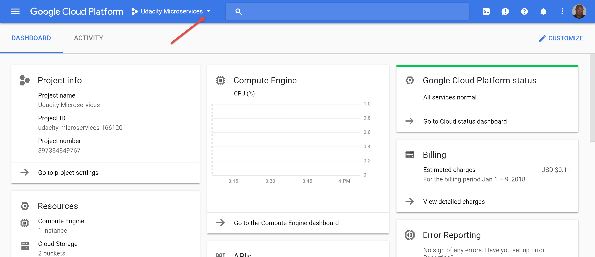
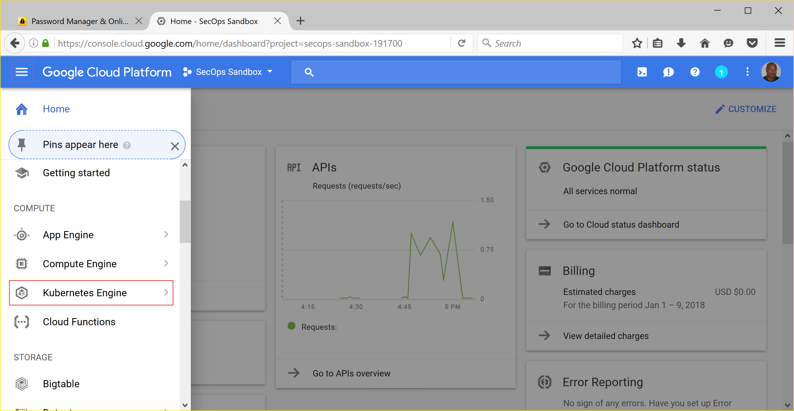

Google Cloud Platform Cluster Setup
===================================

Creating A New Project
----------------------
Navigate to `Google Cloud Platform <https://console.cloud.google.com/home/dashboard>`_ and
click on the project down-arrow to pull up the project selection dialog box:

In the project selection dialog box, click on the **'+'** button. In the next dialog, give
your project a name and wait for it to come up before clicking on the project name link back
in the project selection box.

.. image:: images/project_sel_dialog.png
   :align: center

Creating a Gerrit Server Cluster
--------------------------------

Once the project has come up, from the project dashboard, click on the three horizontal lines
in the upper left next to **Google Cloud Platform** to show the **Product & Services** menu.
Scroll down to **Kubernetes Engine** and select **Kubernetes Clusters** and click on the
**Create Cluster** button to create a Kubernetes cluster.

Fill in the relevant info. My cluster creation data was:

    * Name: gerrit-cluster
    * Machine Type: small
    * Size: 2

The rest of the options I left defaulted. Click the **Create** button and wait for the
cluster to be created. This can take 2-3 minutes. Once the cluster is created, click on
the 'Connect' button to access the **Google Cloud Shell** to configure your cluster.

.. image:: images/cluster_connect.png
   :align: center

I ran the following commands pulled from `Google Cloud Platform Kubernetes Quick Start
Guide <https://cloud.google.com/kubernetes-engine/docs/quickstart>`_. It's a little
dated as many of the cluster creation commands are now automated by the above process.

.. image:: images/gc_cluster_start.jpg
   :align: center

Specifically, I ran the following:

.. code-block:: bash
   :linenos:

   # Get authentication credentials for the cluster
   gcloud container clusters get-credentials gerrit-cluster --zone us-central1-a --project secops-sandbox-191700

   # Deploying an application to the cluster
   # Creating the Deployment
   kubectl run gerrit-server --image=gerritcodereview/gerrit --port 8080

   # Exposing the Deployment
   kubectl expose deployment gerrit-server --type="LoadBalancer"

   # Inspecting and viewing the application
   kubectl get service gerrit-server

This last command will show you what the cluster's external IP address is. In order to
connect to the service from a local web browser, just browse to: **http://<external-ip>:8080**.
If all goes well, when you browse there you'll see the Gerrit Server screen.

.. image:: images/gerrit_docker.png
   :align: center

.. tip:: The > **kubectl run** command uses the following **--image=gerritcodereview/gerrit**.
   This image name was pulled from the `GerritCodeReview/docker-gerrit Github repo
   <https://github.com/GerritCodeReview/docker-gerrit>`_

.. warning::
   If this work is temporary, once you've made your observations, follow the instructions
   in the `Google Cloud Platform Kubernetes Quick Start Guide
   <https://cloud.google.com/kubernetes-engine/docs/quickstart>`_ to shutdown and delete
   your cluster. Day to day load balancing charges can add up.
.. tip::
   If you want to resume your work without going back through the set up, you can change
   your cluster size to zero which effectively shuts it down (though you may still get
   load balancing charges - check to be sure). To resume again, resize your cluster back
   to its original node size. Use these commands:
   > **gcloud config set compute/zone <zone>**
   > **gcloud container clusters resize $CLUSTER_NAME --size=0**

