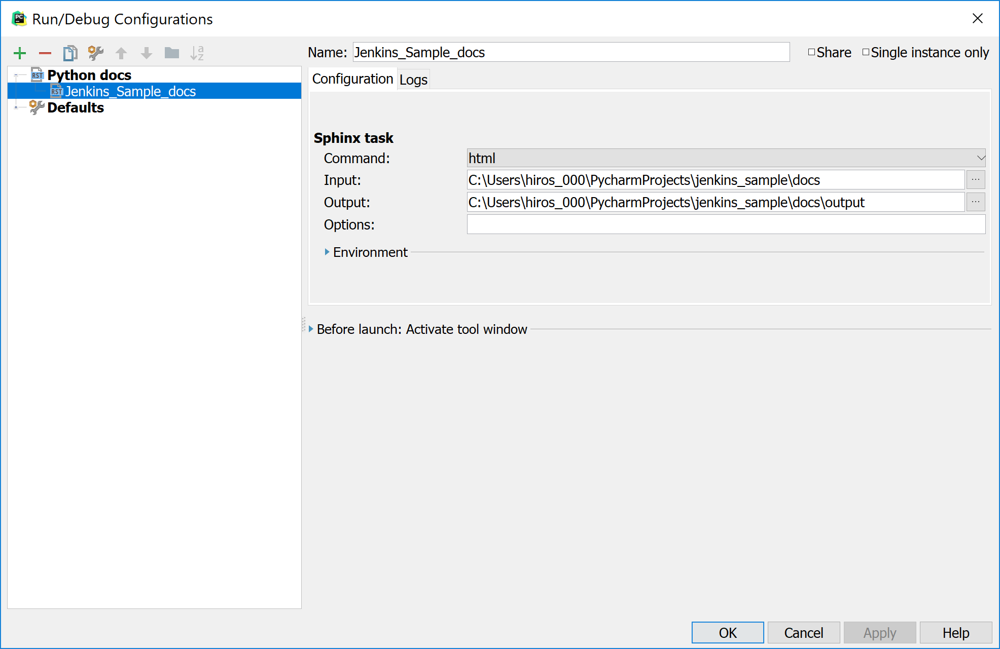

General Setup
=============

ReadTheDocs
-----------
I'm getting back into building dynamic documentation with Sphinx so I found the following documents
helpful to get a quick start:

* `How to Document with Sphinx <https://www.ibm.com/developerworks/library/os-sphinx-documentation/index.html>`_

  * `How to Install The ReadTheDocs Theme <https://github.com/rtfd/sphinx_rtd_theme>`_

* `Restructured Text Quick Reference <https://thomas-cokelaer.info/tutorials/sphinx/rest_syntax.html>`_

In general, the idea is to create your project in Pycharm and create a **'docs'** folder in the project folder.
In a shell window, cd to the 'docs' folder, run the ``sphinx-quickstart`` command to get the skeleton files in place and update
the theme in the ``conf.py`` file to use the **sphinx-rtd-theme** like so:

.. code-block:: python

   # If you don't have Sphinx installed
   pip install sphinx

   # If you don't have the theme installed
   pip install sphinx-rdt-theme

   # Then in your conf.py file
   import sphinx_rtd_theme
   html_theme = "sphinx_rtd_theme"

You can also connect to the newly created project at `readthedocs.org <https://readthedocs.org>`_ and have the
docs auto-built and available to public audience from the cloud. If you decide to do
this, you have to have your project repo on Github set to **public**.

.. important::
   Doc changes need to be merged to the master branch to be picked up by the
   auto-building tools.

PyCharm Sample Run Config
~~~~~~~~~~~~~~~~~~~~~~~~~
To build the sphinx documentation via PyCharm, here's a sample run config. It's pretty
simple in that you only need to specify the directory where the sphinx files are
(e.g. 'docs') and an output directory within that directory (e.g. 'output). If
it doesn't exist, the command will create it automatically

