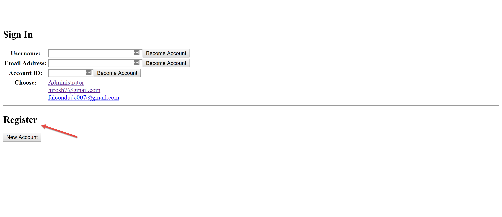
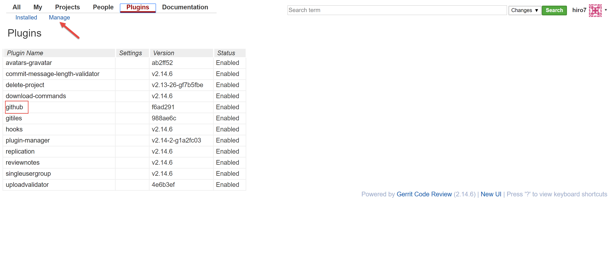

Setting Up Dockerized Gerrit
============================
This section outlines the general steps you need to take to set up Gerrit to be useful
with respect to adding users, a project and integrating it with Github.

Adding Users to Gerrit
----------------------
In the upper right hand corner, click on the down arrow next to the administrator avatar.

.. image:: images/gerrit_change_user.png
   :align: center

This will open a small dialog box where one of the options is to **Switch Accounts**.
Click on that option to be taken to the login / registration page seen below.

At the bottom of that screen, there is a button under **Register** called **New Account**.
Click that to set up a new user account

Install the Gerrit Github Plugin
--------------------------------
For Gerrit <-> Github integration, you should install the Github plugin (provided it's
not already installed). To do this, click on the Plugins tab option and click on the
**Manage** sub-menu. A page will come up with a list of installed and installable
plugins. Select the **Github** plugin and click **Install**

Details for integrating Gerrit and Github can be found `here.
<https://www.packtpub.com/books/content/using-gerrit-github>`_

