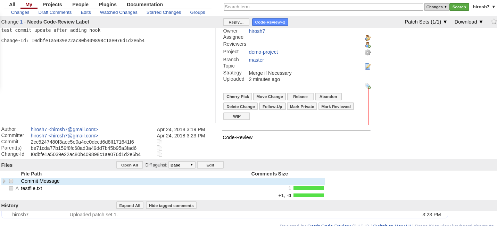

Gerrit Setup
============

I initially tried to run Gerrit in a docker container, but hit two issues:

1) The number of containers I was running was eating up too much RAM

2) I couldn't figure out how to persist Gerrit data across container restarts

So I'm going old school and installing Gerrit on bare metal

The details I'm following are `here <https://gerrit-review.googlesource.com/Documentation/install-quick.html>`_

One update I had to make was to switch the default Gerrit port from 8080 to 8081 just like in the container version.
To do this I edited **~/gerrit_testsite/etc/gerrit.config** and changed the following

.. code:: bash

   [gerrit]
       basePath = git
       serverId = 16c006cd-849e-4e32-a42d-bcfd0caa0800
       canonicalWebUrl = http://Wakanda:8081/

   [httpd]
       listenUrl = http://*:8081/

I also had to simplify authentication. The default OpenID option was a little problematic. There seemed to be no easy way
to set up a separate authenticated admin account. Default setting is to set up the first added user with admin
privileges which is not what I wanted, so I went with

.. code:: bash

   [auth]
        type = DEVELOPMENT_BECOME_ANY_ACCOUNT

as documented in `the auth guide <https://gerrit-review.googlesource.com/Documentation/config-gerrit.html#auth>`_.

.. warning::
   This authentication setting is ONLY for development. When moving to production, choose one of the standard options
   like **OpenID** or **OAuth**.

Gerrit is installed as a service so you can use the following to start and stop Gerrit

.. code:: bash

   ~/gerrit_testsite/bin/gerrit.sh start
   ~/gerrit_testsite/bin/gerrit.sh stop
   ~/gerrit_testsite/bin/gerrit.sh restart

So to commit the config file change, I restarted the Gerrit service

.. note::
   If any configuration changes are made to Gerrit via the /etc/gerrit.config file, you must restart the Gerrit
   service for those changes to take effect.

Configuring Gerrit
------------------

Creating another Gerrit User
~~~~~~~~~~~~~~~~~~~~~~~~~~~~

.. code:: bash

   # create new Gerrit user tchalla
   sudo adduser tchalla
   sudo su tchalla
   cd /home/tchalla

   ssh-keygen -t rsa

   # follow along with the rest of the instructions highlighted above (Gerrit Quick Install)

Importing a project into Gerrit
~~~~~~~~~~~~~~~~~~~~~~~~~~~~~~~

I had problems trying to import my first project into Gerrit using the VCS commands in the Intellij IDE so I took a
step back and configured it to work strictly with git command line commands and will return to the Intellij integration
afterward. Here are the details for the command line approach.

I first had to modify the **simple-java-maven-app** application. I saved the original in a tar file via

.. code:: bash

   # CD to location of simple-java-maven-app directory, then
   tar cvf simple-java-maven-app.tar simple-java-maven-app

I untar'ed it in a different location and the removed the **.idea** and \*.git files

.. code:: bash

   rm -fr .idea .git*

After this the simple-java-maven-app directory should look like this:

.. code:: bash

   ls
   jenkins  my-app.iml  pom.xml  README.md  src

Now run the following git commands

.. code:: bash

   cd simple-java-maven-app
   git init

   Initialized empty Git repository in /home/hirosh7/IdeaProjects/simple-java-maven-app/.git/

   git commit -a

   On branch master

   Initial commit

   Untracked files:
        README.md
        jenkins/
        my-app.iml
        pom.xml
        src/

   nothing added to commit but untracked files present

Here I noticed that the **git commit -a** command doesn't recursively add source files in directories. You can use the
**git ls-files** command to see which files are tracked (and ready to be committed) and which aren't. In order to add
the files under the **jenkins** and **src** directories, I ran

.. code:: bash

   git add jenkins/
   git add src/

   # check to see which files are tracked
   git ls-files

    README.md
    jenkins/Jenkinsfile
    jenkins/scripts/deliver.sh
    my-app.iml
    pom.xml
    src/main/java/com/mycompany/app/App.java
    src/test/java/com/mycompany/app/AppTest.java

    # Now commit all the files
    git commit -a

   [master (root-commit) be71cda] added remaining source files
     7 files changed, 193 insertions(+)
     create mode 100644 README.md
     create mode 100644 jenkins/Jenkinsfile
     create mode 100755 jenkins/scripts/deliver.sh
     create mode 100644 my-app.iml
     create mode 100644 pom.xml
     create mode 100644 src/main/java/com/mycompany/app/App.java
     create mode 100644 src/test/java/com/mycompany/app/AppTest.java

   # Now create the Gerrit project and push the files to it
   ssh -p 29418 hirosh7@wakanda gerrit create-project demo-project
   git push ssh://hirosh7@wakanda:29418/demo-project *:*

    Counting objects: 22, done.
    Delta compression using up to 4 threads.
    Compressing objects: 100% (11/11), done.
    Writing objects: 100% (22/22), 3.54 KiB | 403.00 KiB/s, done.
    Total 22 (delta 0), reused 0 (delta 0)
    remote: Processing changes: done
    To ssh://wakanda:29418/demo-project
     * [new branch]      master -> master

Voila. That worked. At this point we've created a Gerrit project and populated it with the files from the
simple-java-maven-app application. Now we need to make a test change to create a Gerrit code reviewable code
change.

.. code:: bash

   # clone the new Gerrit project into a directory
   mkdir gerrit-projects
   cd gerrit-projects
   git clone ssh://hirosh7@wakanda:29418/demo-project

    Cloning into 'demo-project'...
    remote: Counting objects: 22, done
    remote: Finding sources: 100% (22/22)
    Receiving objects: 100% (22/22), 3.54 KiB | 1.77 MiB/s, done.
    remote: Total 22 (delta 0), reused 22 (delta 0)

   # Now make a simple change
   date > testfile.txt
   git add testfile.txt
   git commit -m "test commit"

    [master b798467] test commit
     1 file changed, 1 insertion(+)
     create mode 100644 testfile.txt

   # And push that change up to Gerrit
   git push origin HEAD:refs/for/master

    Counting objects: 3, done.
    Delta compression using up to 4 threads.
    Compressing objects: 100% (2/2), done.
    Writing objects: 100% (3/3), 293 bytes | 293.00 KiB/s, done.
    Total 3 (delta 1), reused 0 (delta 0)
    remote: Resolving deltas: 100% (1/1)
    remote: Processing changes: refs: 1, done
    remote: ERROR: [b798467] missing Change-Id in commit message footer
    remote:
    remote: Hint: To automatically insert Change-Id, install the hook:
    remote:   gitdir=$(git rev-parse --git-dir); scp -p -P 29418 hirosh7@Wakanda:hooks/commit-msg ${gitdir}/hooks/
    remote: And then amend the commit:
    remote:   git commit --amend
    remote:
    To ssh://wakanda:29418/demo-project
     ! [remote rejected] HEAD -> refs/for/master ([b798467] missing Change-Id in commit message footer)
    error: failed to push some refs to 'ssh://hirosh7@wakanda:29418/demo-project'

Ahh, so close, but no cigar. Note the way to correct this 'missing Change-Id' error is helpfully printed in the error
message itself. So in order to do this successfully we need to add this git commit hook and amend our previous commit

.. code:: bash

   gitdir=$(git rev-parse --git-dir); scp -p -P 29418 hirosh7@Wakanda:hooks/commit-msg ${gitdir}/hooks/
   git commit --amend

    [master 2cc5247] test commit update after adding hook
     Date: Tue Apr 24 15:19:59 2018 -0700
     1 file changed, 1 insertion(+)
     create mode 100644 testfile.txt

   # Now let's try the Gerrit push again
   git push origin HEAD:refs/for/master

    Counting objects: 3, done.
    Delta compression using up to 4 threads.
    Compressing objects: 100% (2/2), done.
    Writing objects: 100% (3/3), 353 bytes | 353.00 KiB/s, done.
    Total 3 (delta 1), reused 0 (delta 0)
    remote: Resolving deltas: 100% (1/1)
    remote: Processing changes: new: 1, done
    remote:
    remote: New Changes:
    remote:   http://Wakanda:8081/#/c/demo-project/+/1 test commit update after adding hook
    remote:
    To ssh://wakanda:29418/demo-project
     * [new branch]      HEAD -> refs/for/master

All's right in the world. The change commit was successful and you can view it in Gerrit via

.. code:: bash

   http://localhost:8081/#/c/demo-project/+/1/

Configuring Gerrit Git with IntelliJ IDE
~~~~~~~~~~~~~~~~~~~~~~~~~~~~~~~~~~~~~~~~
Pretty straightforward. The first approach is to set up the Gerrit project, push the code to Gerrit and then clone
the Gerrit
project in another directory. Then use IntelliJ to open that newly cloned project. It will ask for your Gerrit access
password in a pop-up dialog. This will be the HTTP password you set up previously in Gerrit. If you haven't set this up
yet, go into Gerrit Settings->HTTP Password, generate a password. Copy and paste that password into the pop-up dialog.
You should also save it in IntelliJ by going to Settings->Version Control->Gerrit. For some reason, this data doesn't
seem to be used since each time I push a change to Gerrit, I get asked for the password via the pop-up dialog. Repeated
pushes will also asks for the SSH passphrase we set up despite there being a **Remember** checkbox. That also doesn't
seem to work.

At any rate, when you specify the push, Gerrit options will be presented. Check the **Push to Gerrit** option and then
select any other desired options. I specify that the changes should be reviewed by another developer (user tchalla on
Gerrit), but that also doesn't seem to work yet. I push the change but when I check tchalla's dashboard, there are no
incoming reviews listed.

The ideal approach, which I haven't tried yet, seems to be creating a new, empty Gerrit project, cloning it, opening it
with IntelliJ and then adding the new project files in IntelliJ as you build up the app. I'll confirm this later.

Setting Up Another Reviewer
~~~~~~~~~~~~~~~~~~~~~~~~~~~
Into the heart of darkness...

