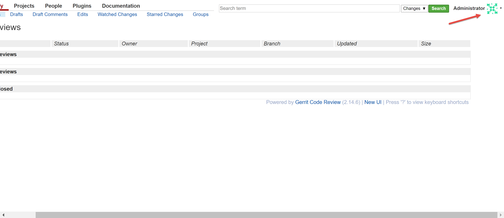

Setting Up Dockerized Gerrit
============================
This section outlines the general steps you need to take to set up Gerrit to be useful
with respect to adding users, a project and integrating it with Github.

Adding Users to Gerrit
----------------------
In the upper right hand corner, click on the down arrow next to the administrator avatar.

This will open a small dialog box where one of the options is to **Switch Accounts**.
Click on that option to be taken to the login / registration page seen below.

At the bottom of that screen, there is a button under **Register** called **New Account**.
Click that to set up a new user account

https://www.packtpub.com/books/content/using-gerrit-github
