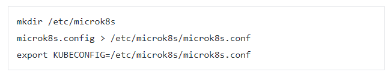

Helm/Kubernetes
===============

.. note::
   Last state mirror of stable charts and incubator charts will be moved to
   https://charts.helm.sh/stable and https://charts.helm.sh/incubator accordingly.

Standard Installation
*********************

.. code:: bash

   # Get latest release from `https://github.com/helm/helm/releases
   <https://github.com/helm/helm/releases>`_
   $ wget https://get.helm.sh/helm-v3.4.2-linux-amd64.tar.gz

   # Extract
   $ tar -zxvf helm-v3.4.2-linux-amd64.tar.gz

   # Move helm to a central location
   $ mv linux-amd64/helm /usr/local/bin/helm

Snap Installation
*****************

.. code:: bash

   # Install Helm3 in the MicroK8S environment - not yet sure which one is the right one
   $ sudo snap install helm3 or sudo snap install helm3 latest/candidate
   $ microk8s enable helm3

   # Install a specific version. By default, Snap will install the version associated with the
   # latest/stable channel which is normally a much older version.
   $ snap install helm3 --channel=latest/candidate

   # Set up the config file
   $ microk8s.kubectl config view --raw > $HOME/.kube/config
   $ chmod 400 HOME/.kube/config

   # Uninstall Helm3
   $ microk8s disable helm3
   $ sudo snap remove helm3

Useful Commands
***************

.. note::
   These notes are based on **helm3**. You can alias the 'helm3' command to just 'helm' for
   convenience but you need to remember that on some systems 'helm' indicates that you're using
   Helm version 2

.. code:: bash

   # Get Helm version info
   $ helm version

   # List all available packages on ArtifactHUB
   $ helm search hub

   # Search for a specific helm chart
   $ helm search hub mysql

   # Adding a helm repo
   $ helm repo add stable https://charts.helm.sh/stable

   # Remove a helm repo
   $ helm repo remove stable

   # List available repos
   $ helm repo list

   # Search repo
   $ helm search repo stable

   # Search repo for a specific chart
   $ helm3 search repo stable/mysql

   # Update a repo
   $ helm repo update

   # Install a helm chart. This example specifies a local name 'myairflow' and the chart name
   $ helm install myairflow stable/airflow

   # This version installs the chart and lets k8s generate a name for it
   $ helm install stable/airflow --generate-name

   # List installed charts
   $ helm ls

   # Delete an installed charts
   $ helm uninstall myairflow

   # Delete a K8S deployment (-n [namespace]). This example deletes an nginx deployment from
   # the 'default' namespace
   $ kubectl delete -n default deployment nginx

   # Create your own chart. Example here is 'mychart'
   $ helm create mychart

Miscellaneous
*************

Udemy Helm/Kubernetes course section on `Creating Chart Templates
<https://www.udemy.com/course/helm-package-manager-for-kubernetes-complete-
master-course/learn/lecture/20424933#overview>`_

.. code:: bash

   # Delete a Pod - in this case the 'ubuntu' pod from the 'default' namespace
   $ delete -n default pod ubuntu

   # Get K8S cluster info
   $ kb cluster-info

   # Get version
   $ kb version --short

   # Search for a configmap
   $ kb describe configmaps <configmap_name>

   # Install a configmap. Example uses a the configmap.yaml file in folder mychart
   $ helm install helm-demo-configmap ./mychart

   # Debug configmap ot see if values are being properly substituted (sample configmap is in ./mychart dir)
   # Note: This deployment is **not** installed. This command shows what will happen **if** you later run the
   #       the install command
   $ helm install --debug --dry-run <configmap_helm_name> ./mychart

   # Set a value on the command line. In this example, in our configmap.yaml file we have a value like the following:
   # **costCode: {{ .Values.costCode }}**
   $ helm install --debug --dry-run --set costCode=BB12345 <configmap_helm_name> ./mychart

   # If you want to set a default for a value that may or may not be in the values.yaml file, do the following
   # in your configmap.yaml file
   > contact: {{ .Values.contact | default "1-800-555-5525" }}

   # Describe a configmap. Get <configmap_helm_name from **helm ls**
   $ kb describe configmap <configmap_helm_name>

   # Get the Helm manifest info
   $ helm get manifest <configmap_helm_name>

   # Create a configmap from a file with Kubernetes
   $ kb create -f <configfile name>

.. note::
   A handy reference is the **Sprig** library on GitHub which has a number of useful `GO template functions
   <http://masterminds.github.io/sprig/>`_ like **upper**, **date**, etc.

.. important::
   If you create a configmap.yaml file, it has to be in the **templates** directory to get recognized by
   microk8s Kubernetes

Troubleshooting
***************
Error: Kubernetes cluster unreachable
+++++++++++++++++++++++++++++++++++++
Try this from `How to make microk8s work with helm 3
<https://worklifenotes.com/2020/01/22/how-to-make-microk8s-work-with-helm/>`_

.. important::
   Make sure to change the **microk8s.conf** file permissions to 400 to avoid warnings

Perhaps a simpler option is to just prefix the command with **microk8s**

.. code:: bash

   # Example
   $ microk8s helm3 <command>

