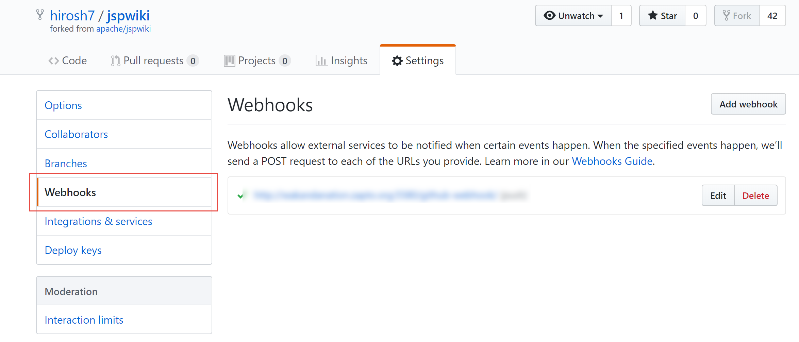
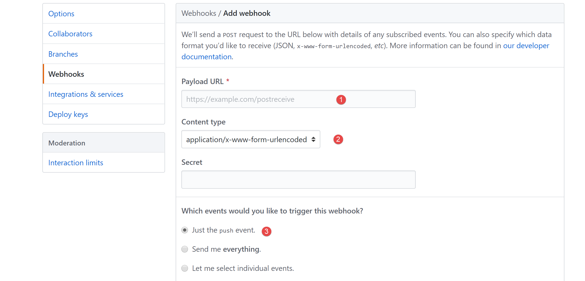
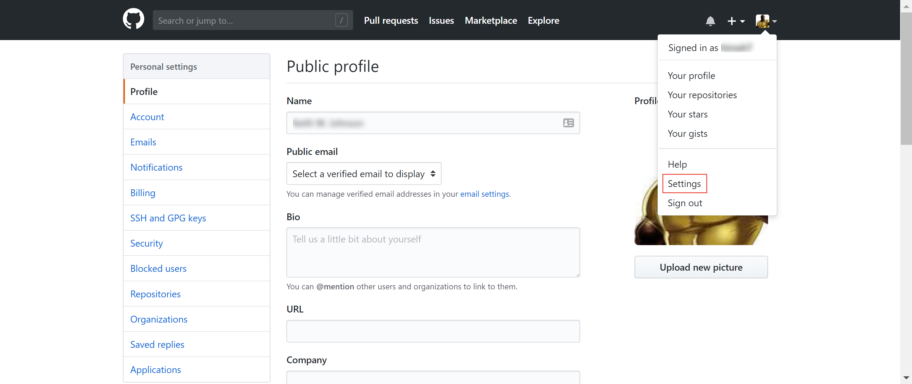
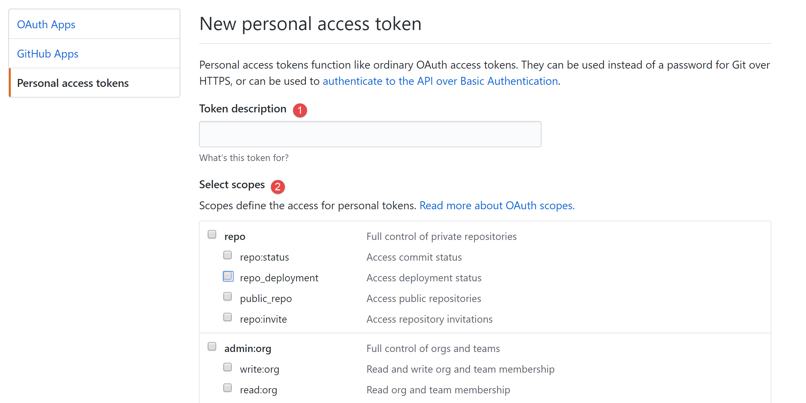

Jenkins / GitHub Integration
============================

In order to get Jenkins to kick of a job for each related GitHub commit, you need to set up several
things in both Jenkins and GitHub. Let's start with GitHub since there is a required access token
you'll need to generate and later save as Jenkins credentials. Basic details for this section come from
the Jenkins `GitHub Plugin reference <https://wiki.jenkins.io/display/JENKINS/GitHub+Plugin>`_

GitHub Updates
~~~~~~~~~~~~~~
On GitHub we need to do a couple things:

#. Set up a webhook integration for our target repository
#. Create a Personal Access Token which will allow Jenkins to confirm that it's activity is authorized

Setting up a GitHub Repo Webhook
++++++++++++++++++++++++++++++++
Navigate to the GitHub repo that you want to connect to Jenkins and click on the repository **Settings**
option. In 'Settings', you'll see several options in the left-hand menu, one of which is **Webhooks**

Click on the **Add Webhook** button to bring up the associated dialog.

Add the following three updates:

#. Add a payload URL. This URL will be used to send data back to your Jenkins instance. An example would
   be http://<my-jenkins-server-name>:8080/github-webhook/
#. Content Type should be **application/json**
#. **Which events would you like to trigger with this webhook?** Select the **Just the push event**
   option

Leave the rest of the options as their default values and click **Add Webhook**. Your webhook should now
be listed in the webhook section (where you get taken when you click on the **Webhooks** menu option).

Setting up the Personal Access Token
++++++++++++++++++++++++++++++++++++
Now we'll set up the personal access token that Jenkins needs go interact with data pushed from GitHub.
To do this, go to your GitHub user drop-down menu and select **Settings**

Then from the left-hand menu bar, select **Developer Settings** and from Developer Settings, select
**Personal Access Tokens**. On the Personal Access Tokens page, click **Generate New Token**.

This finally gets you to the Generate New Token page

Update as follows:

#. Add a good description like **Master Jenkins Dev Server**. The description is helpful as you'll likely
   have many of these tokens for many different applications
#. Select the authorization scopes. These are particularly important to get right for the integration
   to work successfully. For Jenkins authorizations you'll need the following:

   * Repo (select the top options so all the sub-options get selected as well)
   * admin:org_hook
   * admin:repo_hook (select the top options so all the sub-options get selected as well)

With the updates made, click on **Generate Token** and copy your new token string.

.. warning::

   As the warning indicates after you generate your token, you must copy the token at that point as
   you won't be able to see it again. If you fail to do so, your only recourse is to regenerate the
   token.

With these GitHub updates done, it's now time to do similar updates in Jenkins.

Jenkins Updates
~~~~~~~~~~~~~~~

