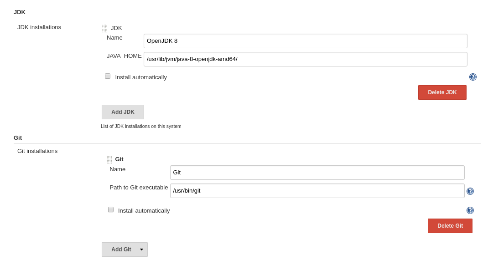
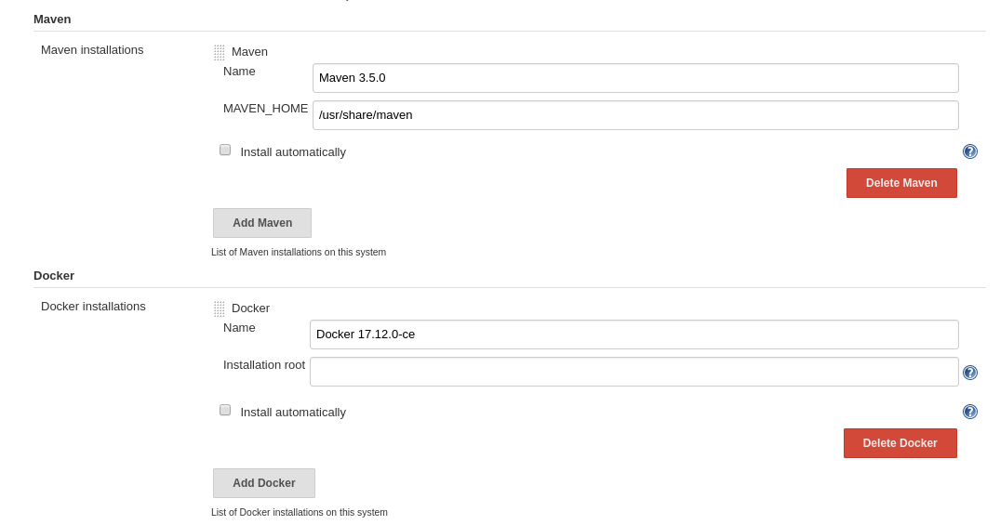
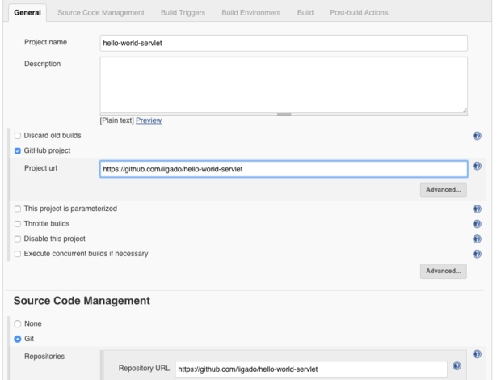
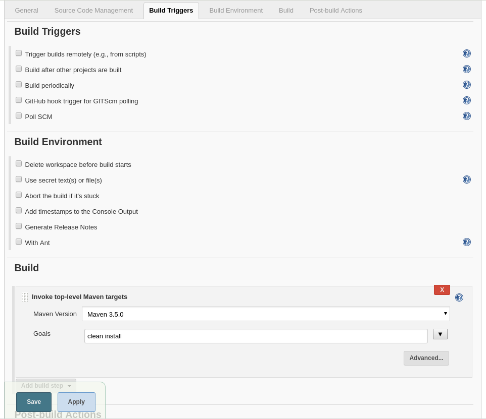
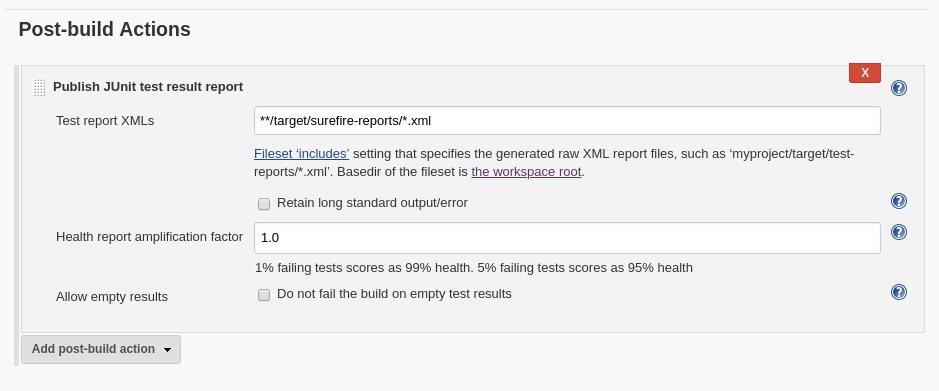
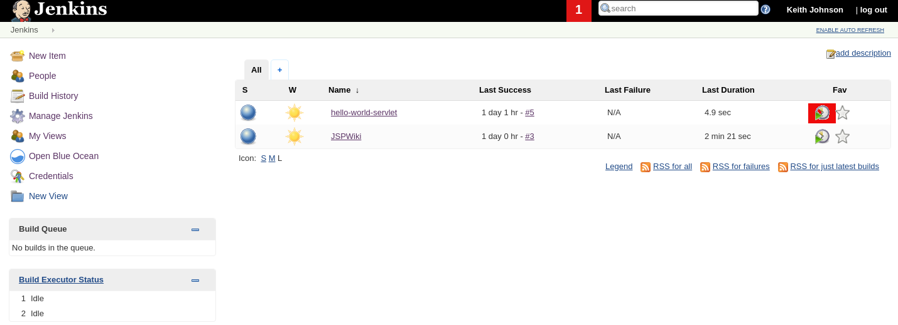

Jenkins Java Webapp Automation
==============================

.. Note::

   These details are based on Jenkins Version 2.89.4

To get our feet wet with an initial Jenkins integration, we'll automate building a small Java webapp. The details for
this are pulled from `here
<https://jenkins.io/doc/tutorials/build-a-java-app-with-maven/>`_

Fork The Sample Application
---------------------------

The Jenkins docker should already be set up if you've followed the directions in **Jenkins Setup (Dockerized Container)
section**. I started on the **Fork and clone the sample repository on GitHub** section and actually forked a different
sample app called `hello-world-servlet <https://github.com/ligado/hello-world-servlet>`_ on GitHub.
This is simple enough. Just log into GitHub, click on the repo link and click the 'Fork' button. GitHub will then
place a copy of the repo under your account. With this, our test source code repo is set up and our repo URL is
**https://github.com/hirosh7/hello-world-servlet***. Below this referred to as our **'forked GitHub repository'**.

Create your Pipeline project in Jenkins
---------------------------------------
1) Go back to Jenkins, log in again if necessary and click create new jobs under Welcome to Jenkins!

   * **Note: If you don’t see this, click New Item at the top left.**

2) In the Enter an item name field, specify the name for your new Pipeline project (e.g. simple-java-maven-app).
3) Scroll down and click Pipeline, then click OK at the end of the page.

   * ( Optional ) On the next page, specify a brief description for your Pipeline in the Description
     field (e.g. An entry-level Pipeline demonstrating how to use Jenkins to build a simple Java application
     with Maven.)

4) Click the Pipeline tab at the top of the page to scroll down to the Pipeline section.
5) From the **Definition** field, choose the **Pipeline script from SCM option**. This option instructs Jenkins
   to obtain    your Pipeline from Source Control Management (SCM), which will be your forked Github repository.
6) From the **SCM** field, choose **Git**.
7) In the **Repository URL** field, specify the directory path of your forked Github repository above

   * Note: You can also do this from a local directory since we've mapped to the /home directory of the Jenkins
     container

8) Click **Save** to save your new Pipeline project. You’re now ready to begin creating your Jenkinsfile,
   which you’ll be checking into your forked Github repository.

Create your initial Pipeline as a Jenkinsfile
---------------------------------------------
Now create your Pipeline that will automate building your Java application with Maven in Jenkins.
Your Pipeline will be created as a **Jenkinsfile**, which will be committed to your forked Github repository.
This is the foundation of "Pipeline-as-Code", which treats the continuous delivery pipeline as a part of
the application to be versioned and reviewed like any other code.

Create a file named **Jenkinsfile** in your project in the top level (same level as the **src** directory) and add
the following:

.. code:: bash

   pipeline {
        agent {
            docker {
                image 'maven:3-alpine'
                args '-v /root/.m2:/root/.m2'
            }
        }
        stages {
            stage('Build') {
                steps {
                    sh 'mvn -B clean package'
                }
            }
        }
   }

This is called **Declarative Pipeline code** that does the following:

* This image parameter (of the agent section’s docker parameter) downloads the **maven:3-apline Docker image**
  (if it’s not already available on your machine) and runs this image as a separate container.
  This means that:

  * You’ll have separate Jenkins and Maven containers running locally in Docker
  * The Maven container becomes the agent that Jenkins uses to run your Pipeline project.
    However, this container is short-lived - its lifespan is only that of the duration of your Pipeline’s
    execution
  * This args parameter creates a reciprocal mapping between the **/root/.m2** (i.e. Maven repository) directories
    in the short-lived Maven Docker container and that of your Docker host’s filesystem.
    The main reason for doing this is to ensure that the artifacts necessary to build your Java
    application (which Maven downloads while your Pipeline is being executed) are retained in the Maven
    repository beyond the lifespan of the Maven container. This prevents Maven from having to download the same
    artifacts during successive runs of your Jenkins Pipeline, which you’ll be conducting later on.
    Be aware that unlike the Docker data volume you created for jenkins-data above, the Docker host’s filesystem
    is effectively cleared out each time Docker is restarted. This means you’ll lose the downloaded Maven
    repository artifacts each time Docker restarts
  * Defines a stage (directive) called Build that appears on the Jenkins UI.
  * This sh step (of the steps section) runs the Maven command to cleanly build your Java application
    (without running any tests)

Add a test stage to your Pipeline
---------------------------------

9) Save and commit your Jenkinsfile (and merge to the master branch if you did these changes in a new branch)
10) Go back to Jenkins again, log in again if necessary and click **Open Blue Ocean** on the left to access
    Jenkins’s Blue Ocean interface. In the **This job has not been run** message box, click **Run**
    then quickly click the OPEN link which appears briefly at the lower-right to see Jenkins running your
    Pipeline project. If you weren’t able to click the OPEN link, click the row on the main Blue Ocean
    interface to access this feature.

Configure Jenkins Global Tools
------------------------------

Now on the Jenkins Dashboard (i.e. top level Jenkins page):

* Click **Manage Jenkins**

  * Choose **Global Tool Configuration**
  * First configure a JDK. Under the JDK section:

    * Click **Add JDK** and give it a name (e.g. OpenJDK 8)
    * Specify the JAVA_HOME path. Here's it's **'/usr/lib/jvm/java-8-openjdk-amd64/'**. You can find this path by
      running **'> update-java-alternatives --list'** on the command line

  * Configure Git similarly
  * Configure Maven

    * Click **Add Maven** and give it a name (e.g. Maven 3.5.0)
    * Specify the MAVEN_HOME path. You can find this along with the version by running **'mvn --version'** on
      the command line

  * Configure Docker

    * Click **Add Docker** and give it a name
    * If you leave the **'Installation root'** blank, Jenkins will go with the default install root path

  * Click **'Save'**

At this point, Jenkins knows where all the tools are required for the following steps. We really aren't using
Docker in this exercise, but it's good to get it out of the way.

Configure Jenkins Build Job
---------------------------

Now back on Jenkins Dashboard:

* Click the **New Item** button and enter the name of your project (e.g. hello-world-servlet)
* Choose the **Freestyle Project** project type
* Click **Ok**

This will take you to the job configuration page below similar to the figure below.

* Choose 'GitHub project'
* Enter the GitHub URL of your project (e.g. https://github.com/hirosh7/hello-world-servlet)
* Under **Source Code Management**:

  * Choose 'Git'
  * Enter the same project URL (e.g. https://github.com/hirosh7/hello-world-servlet)

* The article referenced a **Build when a change is pushed to GitHub** option which is not there in the latest
  this version of Jenkins so I didn't select anything in the **Build Triggers** section. The idea is to choose
  an option so that Jenkins will build your code anytime you push a change to GitHub but obviously this is now
  configured differently

* In the **Build** section, add a new build step, choose **Invoke top-level Maven targets**:

  * Choose the Maven instance that you configured previously (such as "Maven 3.3.9")
  * Enter 'clean install' in the goals field

We'll also configure Jenkins to generate a report that summarizes the unit test execution

* Click **Add post-build action**
* Choose **Publish JUnit test result report**
* Enter the following in the **Test Reports XMLs** text field:

.. code:: bash

   **/target/surefire-reports/*.xml

* When you're finished, press **Save**

The **Test Reports XMLs** field points to the directory where your Surefire tests are published.
Maven creates a target directory, a surefire-reports subdirectory, and then publishes a set of XML files
summarizing the test results to the new directory.

Running the Job
---------------
Okay, finally ready to have Jenkins run a build! Back on the Jenkins Dashboard, you should now see your
job listed similar to the image below.

Click on the **'Build'** icon (highlighted in red). Assuming the build was successful, you'll see a little build
number under the **'Last Success'** column (e.g. #1). It's a link, so you can click on it to get to the build
details screen. To check out the build output, click on **'Console Output'** option in the left nav bar. At the
bottom of the build details screen you'll also see a link for **'Test Results'**. This will, obviously, show
you the results of any unit tests run.

