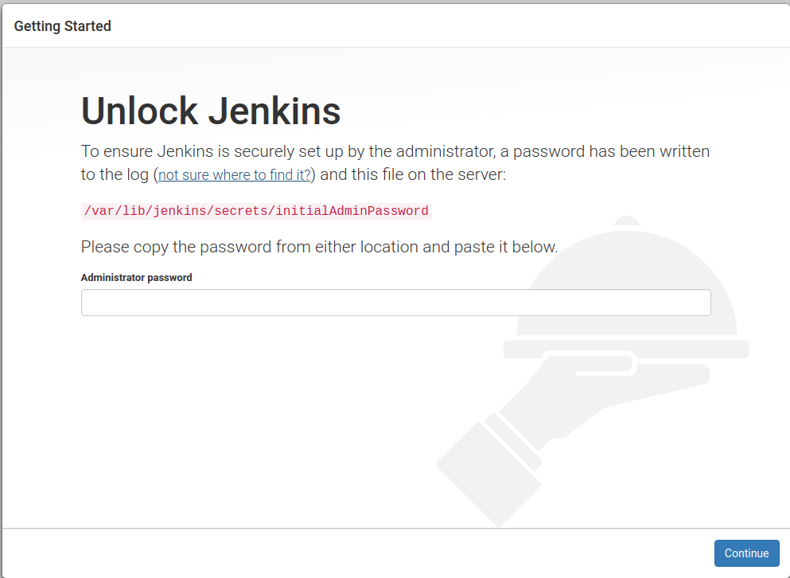

Jenkins Setup
=============

Next we want to install the containerized version of Jenkins. For the initial install, I'll plan
to install standard Jenkins vs. `the containerized Docker version
<https://hub.docker.com/r/jenkins/jenkins/>`_ on Docker Hub. So I'm going by the instructions from
`Jenkins.io <https://jenkins.io/doc/book/installing/#debian-ubuntu>`_ for Linux Debian/Ubuntu installs.

Here are the details:

.. code-block:: bash

   wget -q -O - https://pkg.jenkins.io/debian/jenkins.io.key | sudo apt-key add -
   sudo sh -c 'echo deb http://pkg.jenkins.io/debian-stable binary/ > /etc/apt/sources.list.d/jenkins.list'
   sudo apt-get update
   sudo apt-get install jenkins

This package installation will:

* Setup Jenkins as a daemon launched on start. See /etc/init.d/jenkins for more details.
* Create a jenkins user to run this service.

* Direct console log output to the file /var/log/jenkins/jenkins.log. Check this file if you are troubleshooting
  Jenkins.
* Populate /etc/default/jenkins with configuration parameters for the launch, e.g JENKINS_HOME
* Set Jenkins to listen on port 8080. Access this port with your browser to start configuration.

.. Warning::
   If your /etc/init.d/jenkins file fails to start Jenkins, edit the /etc/default/jenkins to replace the
   line ----HTTP_PORT=8080---- with ----HTTP_PORT=8081---- Here, "8081" was chosen but you can put another
   port available.

Configuring Jenkins
-------------------
Now you can check out the running instance in your browser at **localhost:8080**

The first time, you'll be presented with a setup window which will prompt you for a password.

As indicated in the dialog, you can either find the initial password in the official Jenkins log file at
**/var/log/jenkins/jenkins.log** or at the location mentioned in the dialog -
**/var/lib/jenkins/secrets/initialAdminPassword**.

Next you'll be prompted to install plugins. I selected the **Install Suggested Plugins** option. Next you'll be
prompted to create the first admin account. Finally, you'll be at the main Jenkins page.

Blue Ocean Plugin
~~~~~~~~~~~~~~~~~
Of course, this option didn't install the **BlueOcean plugin** so we need to do this next. Details for this are
pulled from the Jenkins.io `Getting Started with Blue Ocean <https://jenkins.io/doc/book/blueocean/getting-started/>`_
page.

To install the Blue Ocean suite of plugins to your Jenkins instance:

* If required, ensure you are logged in to Jenkins (as a user with the Admin permission).
* From the Jenkins home page (i.e. the Dashboard of the Jenkins classic UI), click **Manage Jenkins** on
  the left and then Manage Plugins in the center.
* Click the Available tab and type blue ocean into the Filter text box, which filters the list of plugins
  to those whose name and/or description contains the words **"blue"** and **"ocean"**.

Select the Blue Ocean plugin’s check box near the top of the the Install column and then click either the
Download now and install after restart button (recommended) or the Install without restart button at the the end of
the page.

.. Note::

   There is no need to select the check boxes of the other plugins in this filtered list because the main Blue
   Ocean plugin has other plugin dependencies (constituting the Blue Ocean suite of plugins) which will automatically
   be selected and installed when you click one of these "Install" buttons.

   If you chose the Install without restart button, you may need to restart Jenkins in order to gain full Blue Ocean
   functionality.
