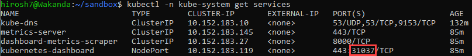
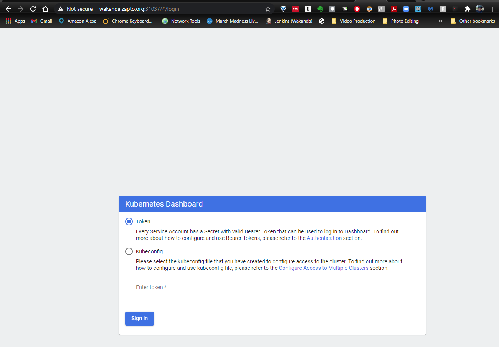
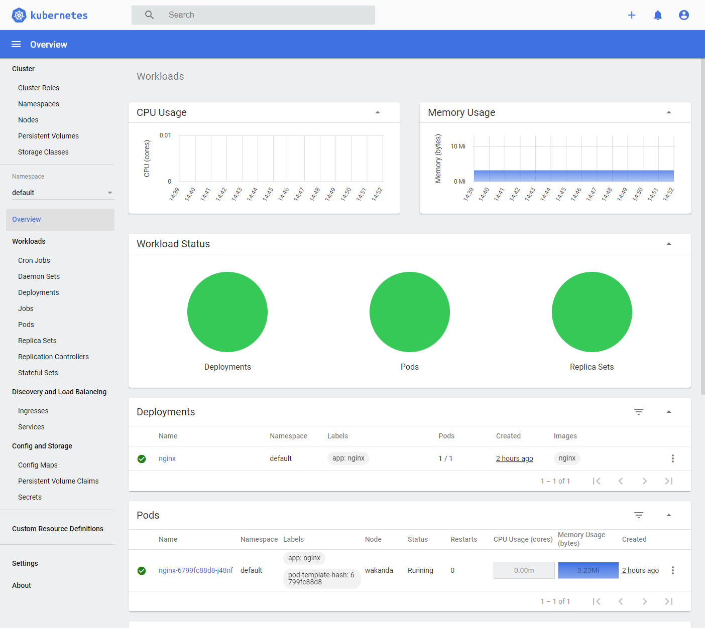

MicroK8S Setup
==============

We'll use microK8s as our Kubernetes clustering option, so we'll
experiment with installation and validation tests in this section. Most info here is pulled from the
`Introduction to MicroK8s <https://microk8s.io/docs>`_.

Installation
~~~~~~~~~~~~
We'll be installing on our updated Ubuntu 20.04 server

.. code:: bash

   # Install MicroK8s
   $ sudo snap install microk8s --classic --channel=1.19

   # Join the group
   $ sudo usermod -a -G microk8s $USER
   $ sudo chown -f -R $USER ~/.kube

   # Re-enter session for group update to take place
   $ su - $USER

   # Check the status
   $ microk8s status --wait-ready

   # Access Kubernetes

   # To view your node
   $ microk8s kubectl get nodes

   # To see running service
   $ microk8s kubectl get services

   # Simplify things by adding an alias to ~/.bash_aliases or ~/.bashrc
   $ alias kubectl='microk8s kubectl'

   # Install a demo app
   $ microk8s kubectl create deployment nginx --image=nginx

   # Starting and Stopping MicroK8s
   $ microk8s stop
   $ microk8s start

Enabling MicroK8s Add-ons
~~~~~~~~~~~~~~~~~~~~~~~~~~
MicroK8s uses the minimum of components for a pure, lightweight Kubernetes.
However, plenty of extra features are available with a few keystrokes using “add-ons” – pre-packaged components
that will provide extra capabilities for your Kubernetes installation

For example, it is recommended to add DNS management to facilitate communication between services.
For applications which need storage, the ‘storage’ add-on provides directory space on the host.
These are easy to set up:

.. code:: bash

   $ microk8s enable dns storage

A full list of add-ons can be found `here <https://microk8s.io/docs/addons#heading--list/>`_.

You can get the current enabled/disabled status of any add-on by running:

.. code:: bash

   $ microk8s.status

Enabling the MicroK8s Dashboard
~~~~~~~~~~~~~~~~~~~~~~~~~~~~~~~
The MicroK8s GUI is really helpful to interact with the cluster (although you should know all
the equivalent CLI commands as well). To enable the dashboard:

.. code:: bash

   $ microk8s enable dashboard

The last part of the output involves setting up the access token:

.. code:: bash

   # If RBAC is not enabled access the dashboard using the default token retrieved with:
   $ token=$(microk8s kubectl -n kube-system get secret | grep default-token | cut -d " " -f1)
   $ microk8s kubectl -n kube-system describe secret $token

The last command will generate a token ID which you should save away. This current token is saved under the
Lastpass **Dell SecOps Desktop Server** entry.

The next step is to set it up so you can access the dashboard externally (from a web browser not on the server
hosting microk8s).
To do this I followed `How to Access Kubernetes Dashboard
Externally <https://www.thegeekdiary.com/how-to-access-kubernetes-dashboard-externally/>`_

In summary:

.. code:: bash

   # Edit the kubernetes-dashboard service YAML file and change the **type** from **ClusterIP** to **NodePort**
   $ kubectl -n kube-system edit service kubernetes-dashboard

   # Check the service to confirm that NodePort is set for kubernetes-dashboard and to get the IP port to use
   $ kubectl -n kube-system get services

The output will show the port type and the target IP port you need to use. In the sample output below
the target port will be **31037**

Now to connect to the Kubernetes dashboard, just open a browser and navigate to:
https://<server_host_ip>:<port_from_get_services_output (e.g.
https://wakanda.zapto.org:31037)

If it all works, you'll see the Kubernetes dashboard login screen:

Drop in the token value you saved previously and you should get logged in and
see the full dashboard:

GUI goodness.

Checking on overall MicroK8s Installation Status
~~~~~~~~~~~~~~~~~~~~~~~~~~~~~~~~~~~~~~~~~~~~~~~~
You can get full status on your installation by running the following command:

.. code:: bash

   # Get description, available commands, services, and release channels
   $ sudo snap info microk8s

   # Get microk8s version
   $ sudo snap list

   # Get detailed info on installation, including key warnings that could lead to trouble. Read and react.
   $ microk8s inspect

