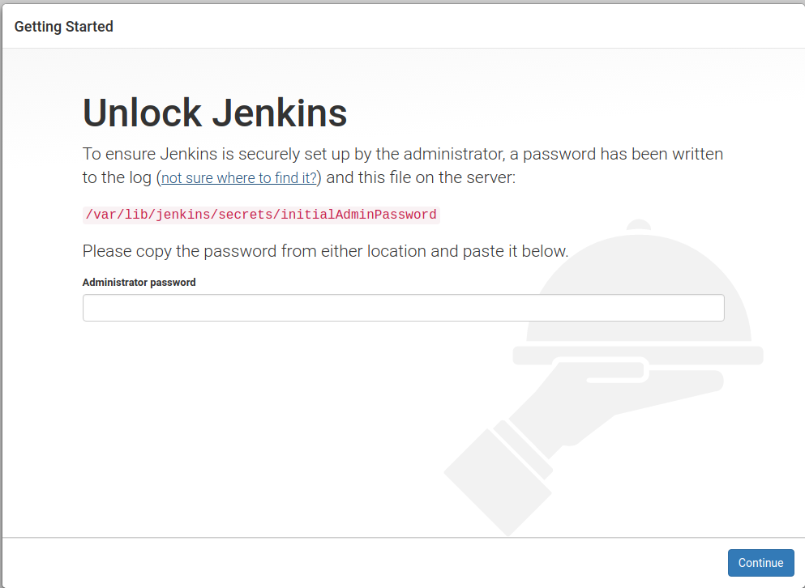

Ubuntu Sandbox Setup
====================
We'll be setting up a Security DevOps (SecOps) sandbox server to experiment with various DevOps
tools and approaches.

Ubuntu Environment
------------------
I've installed a dual boot version of Ubuntu 17.10 along side Windows 10 on a new desktop server.
Credential details are in a LastPass secure note titled **Dell SecOps Desktop Server**. Additional
details:

* Server Name: Wakanda
* Server IP: 192.168.1.2

Docker Installation
-------------------
First step is to install Docker. I pulled the following details from this `GitHub Gist page
<https://gist.github.com/levsthings/0a49bfe20b25eeadd61ff0e204f50088>`_.

.. code-block:: bash

    sudo apt-get update
    sudo apt-get install apt-transport-https ca-certificates curl software-properties-common
    curl -fsSL https://download.docker.com/linux/ubuntu/gpg | sudo apt-key add -
    sudo apt-key fingerprint 0EBFCD88

    sudo add-apt-repository "deb [arch=amd64] https://download.docker.com/linux/ubuntu zesty stable"

    sudo apt-get update
    sudo apt-get install docker-ce

The install worked but when trying a test with the command

.. code-block:: bash

    docker run hello-world

It failed and would only run with the **sudo** command. This blows so I took a look at how to fix
this using Docker's `**Post Installation Steps for Linux** page
<https://docs.docker.com/install/linux/linux-postinstall/>`_. Here are the details:

.. code-block:: bash

   # To create the docker group and add your user:

   # Create the docker group.
   $ sudo groupadd docker

   # Add your user to the docker group.
   $ sudo usermod -aG docker $USER

   # Log out and log back in so that your group membership is re-evaluated.
   <ctrl><alt><delete>

   # Verify that you can run docker commands without sudo.
   $ docker run hello-world

Worked like a charm! Docker installed.

Jenkins Installation
--------------------
Next we want to install the containerized version of Jenkins. For the initial install, I'll plan
to install standard Jenkins vs. `the containerized Docker version
<https://hub.docker.com/r/jenkins/jenkins/>`_ on Docker Hub. So I'm going by the instructions from
`Jenkins.io <https://jenkins.io/doc/book/installing/#debian-ubuntu>`_ for Linux Debian/Ubuntu installs.

Here are the details:

.. code-block:: bash

   wget -q -O - https://pkg.jenkins.io/debian/jenkins.io.key | sudo apt-key add -
   sudo sh -c 'echo deb http://pkg.jenkins.io/debian-stable binary/ > /etc/apt/sources.list.d/jenkins.list'
   sudo apt-get update
   sudo apt-get install jenkins

This package installation will:

* Setup Jenkins as a daemon launched on start. See /etc/init.d/jenkins for more details.
* Create a jenkins user to run this service.

* Direct console log output to the file /var/log/jenkins/jenkins.log. Check this file if you are troubleshooting
  Jenkins.
* Populate /etc/default/jenkins with configuration parameters for the launch, e.g JENKINS_HOME
* Set Jenkins to listen on port 8080. Access this port with your browser to start configuration.

.. Warning::
   If your /etc/init.d/jenkins file fails to start Jenkins, edit the /etc/default/jenkins to replace the
   line ----HTTP_PORT=8080---- with ----HTTP_PORT=8081---- Here, "8081" was chosen but you can put another
   port available.

Configuring Jenkins
~~~~~~~~~~~~~~~~~~~
Now you can check out the running instance in your browser at **localhost:8080**

The first time, you'll be presented with a setup window which will prompt you for a password.

As indicated in the dialog, you can either find the initial password in the official Jenkins log file at
**/var/log/jenkins/jenkins.log** or at the location mentioned in the dialog -
**/var/lib/jenkins/secrets/initialAdminPassword**.

Next you'll be prompted to install plugins. I selected the **Install Suggested Plugins** option. Next you'll be
prompted to create the first admin account. Finally, you'll be at the main Jenkins page.

Of course, this option didn't install the **BlueOcean plugin** so we need to do this next.

